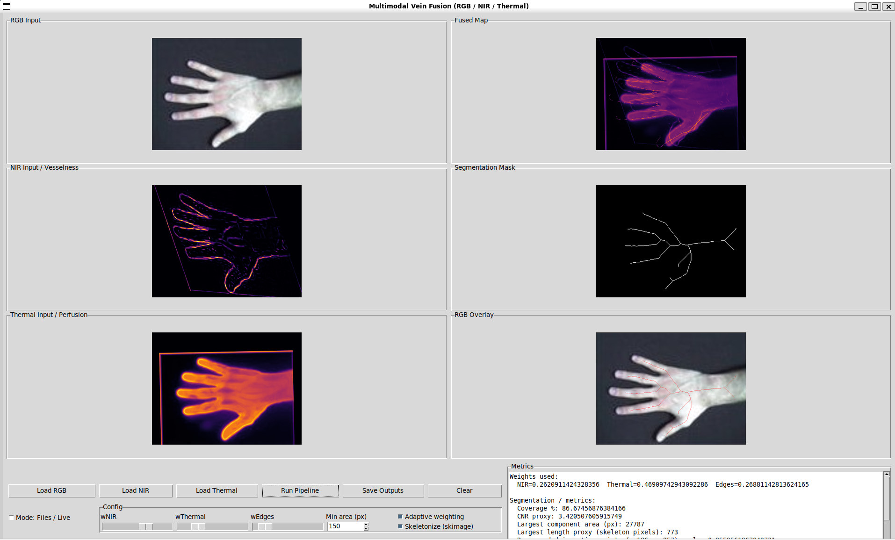

# multimodal_vein_fusion

Multimodal hand‑vein fusion pipeline + desktop GUI that combines **RGB + NIR + Thermal** into:

- a fused “vein likelihood” map,
- a binary vein mask (optionally skeletonized),
- an RGB overlay preview,
- and a JSON bundle of simple quality/coverage metrics.

This is a classical computer‑vision pipeline (no deep learning): filtering, registration, weighted fusion, thresholding, and morphology.



---

## Quickstart

From the `multimodal_vein_fusion/` folder:

```bash
# If your system has no `python` command (common on Linux), use `python3`.
# (recommended) install editable so imports work from anywhere
python -m pip install -e .

# optional: better vesselness (Frangi) + skeletonization
python -m pip install -e ".[skimage]"

# run the GUI
python -m multimodal_vein_fusion.gui
```

Command‑line (headless) run:

```bash
python -m multimodal_vein_fusion.cli.run \
  --rgb path/to/rgb.png \
  --nir path/to/nir.png \
  --thermal path/to/thermal.npy \
  --out outputs/run_001
```

---

## End‑to‑end process (what happens when you click “Run pipeline”)

The main pipeline is implemented in `src/multimodal_vein_fusion/processing/__init__.py` as `run_pipeline()`:

1. **Load inputs**
   - RGB is loaded as `uint8` (0–255).
   - NIR is loaded and normalized to `float32` in **[0, 1]**.
   - Thermal is loaded as `float32` (any scale; later robustly normalized).
2. **Hand ROI extraction from RGB**
   - A **skin mask** is computed in HSV space (two hue ranges for red-ish skin tones), cleaned with morphology, then reduced to the **largest filled contour**.
   - If HSV skin detection fails (too small area), a fallback uses **Gaussian blur + Otsu thresholding** on RGB grayscale.
3. **RGB structural edges**
   - RGB is converted to grayscale, blurred, then **Canny edges** are computed and masked by the hand ROI.
4. **NIR “vesselness” enhancement**
   - NIR is contrast‑enhanced via **CLAHE** (adaptive histogram equalization).
   - The image is inverted so veins become “bright ridges”.
   - If `scikit-image` is installed: **Frangi vesselness** is used.
   - Otherwise: a lightweight **multi‑scale Hessian vesselness** (Frangi‑style) fallback is used (Sobel second derivatives → Hessian eigenvalues → vesselness score).
5. **Thermal “perfusion” map**
   - Thermal is robustly normalized using percentiles (2–98%), smoothed by **Gaussian blur**, and combined with the (normalized) **gradient magnitude**:
     - `perfusion = 0.7 * thermal_norm + 0.3 * gradient_norm`
6. **Cross‑modal registration to RGB**
   - Both NIR and thermal maps are resized to RGB resolution.
   - A hand mask is also estimated from the modality (Otsu + morphology), optionally guided by the RGB hand mask.
   - A **coarse similarity transform** (scale + rotation + translation) is computed from mask moments (center + principal axis).
   - For NIR specifically, an additional candidate is computed using **ORB keypoints + BFMatcher + Lowe ratio test + RANSAC affine** (`estimateAffinePartial2D`).
   - The best candidate warp is selected using **IoU** of boundaries/edges (and mask IoU if available).
   - The selected warp is refined using **ECC alignment** (`cv2.findTransformECC`) on hand boundaries; it’s accepted only if it does not reduce the chosen IoU score beyond a small tolerance.
7. **Fusion**
   - The fused map is a **weighted sum**:
     - `fused = w_nir * nir_vesselness + w_thermal * thermal_perfusion + w_edges * rgb_edges`
   - Optional **adaptive weighting** down‑weights modalities that look unreliable:
     - Low contrast (robust p95–p5) ⇒ lower weight.
     - Poor registration proxies (NIR inlier ratio; thermal ECC score) ⇒ lower weight.
   - Weights are always renormalized to sum to 1.
8. **Vein segmentation**
   - **Otsu thresholding** is applied to fused values inside the hand mask.
   - The binary mask is cleaned using **morphological open/close** and **small component removal** (connected components).
   - Optional: `scikit-image` **skeletonization** can produce a 1‑pixel‑wide centerline for display/length proxy.
9. **Visualization + metrics**
   - A red transparent overlay is produced by alpha‑blending the mask onto RGB.
   - Metrics are computed:
     - coverage (%) inside the hand region,
     - a simple **CNR proxy** using fused values inside vs. outside the vein mask,
     - largest component area and a length proxy,
     - a “recommended insertion point” = maximum fused value inside the largest component,
     - plus registration quality metadata and weights actually used.

---

## Methods / algorithms used (by module)

### RGB (hand mask + edges)

- **Skin segmentation (HSV thresholding)** with morphology (`compute_hand_mask` in `processing/rgb_features.py`).
- **Otsu threshold fallback** if HSV fails.
- **Canny edges** on blurred grayscale (`compute_rgb_edges` in `processing/rgb_features.py`).

### NIR (vessel enhancement)

- **CLAHE** for local contrast normalization.
- **Frangi vesselness** (if available via `scikit-image`), otherwise:
- **Hessian‑based multi‑scale vesselness** (Sobel 2nd derivatives, Hessian eigenvalues, Frangi‑style score) in `processing/nir_vesselness.py`.

### Thermal (perfusion‑like map)

- **Robust percentile normalization** (2–98%).
- **Gaussian smoothing** + **Sobel gradient magnitude**.
- Linear combination of temperature + gradient cues (`processing/thermal_features.py`).

### Registration (NIR/thermal → RGB)

- **Coarse similarity transform from masks**: centroid alignment + principal‑axis rotation + scale from mask area ratio.
- **ORB keypoints + RANSAC affine** for NIR (when feature matches are strong).
- **IoU‑based candidate selection** (mask IoU if plausible, else boundary/edge IoU).
- **ECC refinement** (`cv2.findTransformECC`) using an affine motion model.

### Fusion + segmentation + metrics

- **Weighted sum fusion**, with optional **adaptive re‑weighting** based on robust contrast and registration quality proxies (`processing/fusion.py`).
- **Otsu threshold**, **morphology**, and **connected components filtering** for segmentation (`processing/segmentation.py`).
- **Coverage / CNR proxy / largest component / insertion point** metrics (`processing/metrics.py`).

---

## Inputs

- **RGB**: `.png` / `.jpg` (color).
  - Used for ROI extraction (hand mask) and edge cues.
- **NIR**: `.png` / `.jpg` (grayscale preferred; color is converted to grayscale).
  - Loader behavior (`io/loaders.py`):
    - `uint8` → divide by 255 → `[0,1]`
    - `uint16` → divide by 65535 → `[0,1]`
    - float → min/max normalize to `[0,1]`
- **Thermal**:
  - `.npy` (preferred): 2D array (H,W) in any numeric units. 3D arrays are averaged across channels with a warning.
  - `.png`: 16‑bit supported; 8‑bit accepted with a warning. Values are treated as “raw” and later robustly normalized.

Tip: registration is easier when all three modalities show roughly the same hand pose (little motion between captures).

---

## Outputs

When you click **Save Outputs** in the GUI (or run the CLI), the following are written:

- `rgb.png` — the RGB input.
- `nir_vesselness.png` — enhanced NIR vesselness map (after registration to RGB), saved as 8‑bit grayscale.
- `thermal_perfusion.png` — thermal perfusion map (after registration to RGB), saved as 8‑bit grayscale.
- `fused_map.png` — fused vein likelihood map, saved as 8‑bit grayscale.
- `vein_mask.png` — binary (or skeletonized) vein mask used for display.
- `overlay.png` — RGB overlay of the mask on the original RGB.
- `metrics.json` — metrics + metadata; includes weights used, coverage, CNR proxy, largest component stats, insertion point, registration quality, and any warnings.

---

## How to run

### 1) Install dependencies (recommended)

From `multimodal_vein_fusion/`:

```bash
python -m pip install -e .
```

Optional features:

```bash
python -m pip install -e ".[skimage]"  # Frangi vesselness + skeletonization
python -m pip install pylepton         # optional: FLIR Lepton thermal camera support
```

Notes:
- `tkinter` is part of the Python standard library on many platforms, but on some Linux distros you may need to install it separately (e.g. `python3-tk`).
- `pylepton` is not included in `pyproject.toml` because it’s hardware‑specific.

### 2) Run the GUI

```bash
python -m multimodal_vein_fusion.gui
```

The GUI supports:
- **Files mode**: load RGB/NIR/Thermal from disk and run the pipeline.
- **Live mode**: attempts to open cameras using OpenCV (`RGB=0`, `NIR=1`, `Thermal=2`), falling back to Lepton if available.

### 3) Run headless (CLI)

```bash
python -m multimodal_vein_fusion.cli.run --help
```

Example run with custom weights and options:

```bash
python -m multimodal_vein_fusion.cli.run \
  --rgb sample/rgb.jpg \
  --nir sample/nir.png \
  --thermal sample/thermal.npy \
  --out outputs/run_001 \
  --w-nir 0.7 --w-thermal 0.2 --w-edges 0.1 \
  --min-area 200 \
  --skeletonize
```

### 4) Run tests

```bash
python -m pytest
```

---

## Programmatic usage (import the pipeline)

```python
from multimodal_vein_fusion.io import load_rgb, load_nir, load_thermal
from multimodal_vein_fusion.processing import PipelineConfig, run_pipeline

rgb = load_rgb("rgb.png")
nir = load_nir("nir.png")
thermal = load_thermal("thermal.npy").array

result = run_pipeline(rgb=rgb, nir=nir, thermal=thermal, config=PipelineConfig())
print(result.metrics["coverage_pct"], result.metrics["recommended_insertion_point"])
```

---

## Repository structure (1‑line per file)

Top level:

- `README.md` — this documentation (pipeline description, algorithms, running instructions).
- `pyproject.toml` — Python packaging metadata and dependencies (plus optional `scikit-image` extra).
- `sitecustomize.py` — local helper that adds `src/` to `sys.path` when running from this folder.
- `multimodal_vein_fusion/__init__.py` — “src layout” import shim so `python -m multimodal_vein_fusion.gui` works without installing.

Core package (`src/multimodal_vein_fusion/`):

- `src/multimodal_vein_fusion/__init__.py` — package version.
- `src/multimodal_vein_fusion/gui.py` — GUI entrypoint (`python -m multimodal_vein_fusion.gui`).
- `src/multimodal_vein_fusion/cli/__init__.py` — CLI package marker.
- `src/multimodal_vein_fusion/cli/run.py` — headless runner that loads inputs, runs pipeline, and saves outputs.
- `src/multimodal_vein_fusion/app/__init__.py` — GUI app package marker.
- `src/multimodal_vein_fusion/app/state.py` — `AppState` dataclass storing GUI state and current inputs.
- `src/multimodal_vein_fusion/app/camera_sources.py` — camera adapters (OpenCV camera, UVC thermal, optional Lepton).
- `src/multimodal_vein_fusion/app/gui_app.py` — Tkinter GUI implementation (file/live modes, pipeline execution, saving).
- `src/multimodal_vein_fusion/io/__init__.py` — exports `load_rgb/load_nir/load_thermal/save_outputs`.
- `src/multimodal_vein_fusion/io/schema.py` — dataclasses for loader return types (`ThermalLoadResult`).
- `src/multimodal_vein_fusion/io/loaders.py` — RGB/NIR/Thermal loaders + normalization rules.
- `src/multimodal_vein_fusion/io/writers.py` — output writer (PNG images + `metrics.json`).
- `src/multimodal_vein_fusion/processing/__init__.py` — `run_pipeline()` orchestration + `PipelineConfig/PipelineResult`.
- `src/multimodal_vein_fusion/processing/rgb_features.py` — RGB hand mask + edge extraction.
- `src/multimodal_vein_fusion/processing/nir_vesselness.py` — NIR vesselness (Frangi or Hessian fallback).
- `src/multimodal_vein_fusion/processing/thermal_features.py` — thermal perfusion feature extraction.
- `src/multimodal_vein_fusion/processing/registration.py` — affine registration (coarse similarity, ORB+RANSAC, ECC refine).
- `src/multimodal_vein_fusion/processing/fusion.py` — weighted/adaptive fusion of NIR + thermal + edges.
- `src/multimodal_vein_fusion/processing/segmentation.py` — Otsu threshold segmentation + morphology + (optional) skeletonize.
- `src/multimodal_vein_fusion/processing/metrics.py` — coverage/CNR/largest component/insertion point metrics.
- `src/multimodal_vein_fusion/viz/__init__.py` — exports visualization helpers.
- `src/multimodal_vein_fusion/viz/overlay.py` — mask overlay alpha‑blend onto RGB.

Tests (`tests/`):

- `tests/conftest.py` — ensures `src/` is importable during testing.
- `tests/test_fusion.py` — unit tests for fusion weights/adaptive behavior.
- `tests/test_registration.py` — unit tests for registration robustness on synthetic affine warps.
- `tests/test_segmentation.py` — unit tests for segmentation cleanup (small component removal).
- `tests/test_metrics.py` — unit tests for metrics fields and insertion point selection.

Generated / local artifacts (safe to ignore/remove):

- `.pytest_cache/` — pytest cache.
- `__pycache__/` — Python bytecode caches.
- `src/multimodal_vein_fusion.egg-info/` — build/install metadata (often created by `pip install -e .`).
- `multimodal_vein_fusion/.venv/` — a local virtual environment (not required; you can create your own elsewhere).
